<div align="center">


<br/>

[](https://maherbhatt.me)
[](https://linkedin.com/in/maher-bhatt-206035362)
[](mailto:maherbhatt01@gmail.com)
[](https://credly.com/users/maher-bhatt)
[](https://instagram.com/_maher_bhatt_)


</div>

> **Straight talk:** I build with an AI-assisted workflow and I say so. I'm closing the gap between *"it works"* and *"I know exactly why it works"*, one fundamental at a time. Every project below is part of that climb.

---

## ⚡ Currently

| 🔨 Building | 📚 Learning | 🎯 Chasing |
|:--|:--|:--|
| **K.A.L.K.I.**, next release dropping in 2 days | Git, Python depth, DSA | Frontend / full-stack internship |
| **CodeDroid**, Android IDE | DBMS, Java & OOP | Freelance client work |
| **Civic Sathi** & **StatSkill AI**, SIH 2026 | Node / Express / Firebase | A published multi-agent LLM paper |
| **Personal sites & client sites** | Offensive security, CTFs | Web3 & Solidity basics |

---

## 🛰️ K.A.L.K.I. — voice AI for Windows, live on the Microsoft Store

<div align="center">

</div>

A fully voice-controlled assistant with a multi-model router: Groq LLaMA-3.3-70B for conversation, LLaMA-4-Scout for vision, offline Ollama as the fallback. It ships a hardware-bound DPAPI secure vault, semantic memory, a cybersecurity toolkit (Webscan, Shodan OSINT, CVE intel), a state-reactive PWA HUD and Telegram control.

**Live:** v1.0.24 · **Next release:** dropping in 2 days

[Repo](https://github.com/Maher-Bhatt/KALKI) · [Releases](https://github.com/Maher-Bhatt/KALKI/releases) · [Microsoft Store](https://apps.microsoft.com/detail/9P6HJPQZBGFQ)

---

## 🧪 Research

<div align="center">

</div>

I'm researching **multi-agent LLM systems** with Dhyani. The aim is a concrete contribution: beat an existing accuracy baseline by a couple of points, then publish. **Status: in progress, nothing published yet.**

---

## 🚀 Projects

<table>
<tr>
<td width="50%" valign="top">

### 📱 CodeDroid
A pocket IDE for Android that **runs your code on-device**. Python and JS run offline (Chaquopy + Rhino), 14+ more languages via Piston. 18-language highlighting, Vim keybindings, terminal, live HTML/CSS preview.

`Kotlin` `Jetpack Compose` `Material 3` `CodeMirror`

[Repo](https://github.com/Maher-Bhatt/CodeDroid) · [APK](https://github.com/Maher-Bhatt/CodeDroid/releases/latest)

</td>
<td width="50%" valign="top">

### 🏛️ Civic Sathi · SIH 2026
Municipal intelligence and civic operations platform for citizen complaints. Four portals (public, municipality, contractor, admin), duplicate and systemic-issue clustering, AI triage. I lead the frontend.

`React 19` `FastAPI` `Neon Postgres` `HDBSCAN` `Groq`

</td>
</tr>
<tr>
<td width="50%" valign="top">

### 📊 StatSkill AI · SIH 2026
Skill-gap assessment and adaptive learning platform for the statistical workforce. I build the frontend, a teammate builds the backend.

`React` `TypeScript` `Vite` `Recharts` `Framer Motion`

</td>
<td width="50%" valign="top">

### 📚 ITM Notes
Exam-prep platform used by ITM CSE students. 150+ MCQs, accordion Q&A, Supabase auth with download gating. Co-built with Anurag Pandey.

`React` `Supabase` `shadcn/ui`

[Live](https://itm-notes-new.vercel.app/) · [Repo](https://github.com/Maher-Bhatt/itm-notes)

</td>
</tr>
<tr>
<td width="50%" valign="top">

### 👕 Z Tees
Streetwear storefront: 32-piece catalog, slug routing, galleries, context-driven cart, WhatsApp/UPI checkout.

`React` `TypeScript` `Framer Motion`

[ztees.store](https://ztees.store)

</td>
<td width="50%" valign="top">

### 🏢 Velocity Web
Custom web development agency, co-founded with Anurag Pandey and Jaydev Singh Gohil. Real clients, custom builds, no templates.

`React` `TypeScript` `Vite` `Three.js` `GSAP`

[velocityweb.online](https://velocityweb.online)

</td>
</tr>
</table>

<details>
<summary><b>🎨 Design work & ⏸️ on-hold concepts</b></summary>
<br/>

- **CampusLoop:** original college-student social app, five mobile screens in Figma with a clickable prototype
- **SwasthyaSetu AI:** AI-powered rural preventive healthcare platform (SIH)
- **FinMate AI** *(on hold)*: AI bookkeeping for Indian freelancers and shopkeepers, validated against Zoho Books, Tally and Vyapar, paused for bandwidth

</details>

---

## 🌐 My Sites

<div align="center">

</div>

| Site | What it is |
|:--|:--|
| [maherbhatt.me](https://maherbhatt.me) | Personal portfolio and ATS resume |
| [velocityweb.online](https://velocityweb.online) | Agency site |
| [ztees.store](https://ztees.store) | Streetwear storefront |
| [itm-notes-new.vercel.app](https://itm-notes-new.vercel.app/) | Study platform for ITM students |
| [K.A.L.K.I. on the Microsoft Store](https://apps.microsoft.com/detail/9P6HJPQZBGFQ) | Voice AI assistant |

---

## 🧰 Stack

<div align="center">

</div>

---

## 🏅 Wins & Timeline

| | |
|:--|:--|
| 🥈 **2nd, Bug Bounty Challenge** | Security BSides Vadodara. Our team was the only one from ITM SLS Baroda to place |
| 🎯 **4th, Capture The Flag** | Security BSides Vadodara |
| 🕵️ **OSINT & Cybersecurity Seminar** | Live MITM, phishing sim, steganography and Burp Suite demos at Jawahar Navodaya Vidyalaya |
| 🏅 **Winner, AI Meme Challenge** | Raccoon AI Event, ITM |
| 🎮 **Illuminati Game Jam** | Shipped a game in Unreal Engine |
| 🏛️ **Smart India Hackathon 2026** | Team selected for the next round with Civic Sathi |
| 📜 **27+ credentials** | ~20 Google Cloud skill badges · IBM Python/Data · Outskill GenAI · NCFE × Hack2skill |

```text
2025 ─ Started B.Tech CSE (Core) · ITM SLS Baroda University
2026 ─ Mar  Founded Velocity Web
     ─ Apr  Python Development Intern @ QSkill (+ Letter of Recommendation)
     ─ ...  Shipped Z Tees, ITM Notes, CodeDroid · K.A.L.K.I. on the Microsoft Store
     ─ ...  Security BSides Vadodara: 🥈 Bug Bounty · 4th CTF
     ─ NOW  K.A.L.K.I. next release · SIH 2026 · multi-agent LLM research
```

---

## 📊 Activity

<div align="center">


<br/><br/>

**Hiring for frontend/full-stack? Need a site that converts? Want to build AI dev-tools?**

[](mailto:maherbhatt01@gmail.com)


</div>
